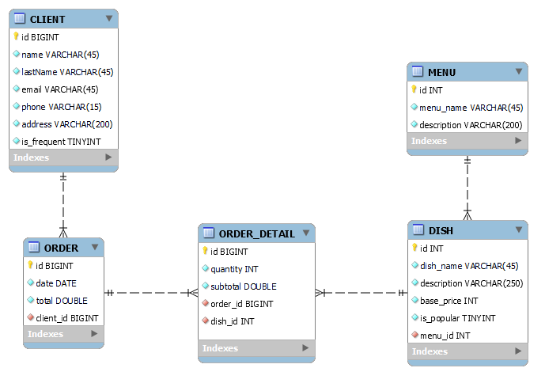

## API REST

Es una interfaz de programación de aplicaciones (API) que sigue los principios de la arquitectura REST (Representational State Transfer).

Es un conjunto de reglas que permite a sistemas interactuar entre sí utilizando métodos estándar del protocolo HTTP, como GET, POST, PUT, DELETE, etc.
El término "API REST" se usa para referirse a una API que implementa parcialmente o completamente las restricciones definidas por REST.

## RESTful

Es un adjetivo que describe una API que cumple completamente con los principios de REST.

Una API es RESTful si sigue estrictamente los siguientes principios:
- Arquitectura cliente-servidor: Separación entre cliente (interfaz) y servidor (datos y lógica).

- Stateless: Cada solicitud del cliente al servidor debe contener toda la información necesaria para entenderla.

- Caché: Las respuestas deben ser cacheables cuando sea posible para mejorar el rendimiento.

- Interfaz uniforme: Uso consistente de métodos HTTP, URIs, y representaciones de recursos.

- Sistema en capas: Posibilidad de usar capas intermedias entre cliente y servidor.

## Stateless

En el contexto de REST, el término stateless (sin estado) significa que cada solicitud del cliente al servidor debe ser independiente y contener toda la información necesaria para que el servidor pueda procesarla, sin depender del estado de solicitudes anteriores.

## Que hay en este repositorio...

Se estructura un API Restful para la administración de un restaurante. Se usa Java 17 con Gradle. El proyecto se enfoca en la gestión de pedidos, para lo cual adicionalmente se gestionan menús, platos y clientes.

El proyecto se estructura con las siguientes consideraciones:

- Controladores: Gestionan las rutas del API.
- Servicios: Contienen la lógica del negocio.
- Modelos: Representan las entidades de dominio.
- Repositorios: Gestionan la interacción con la base de datos.

Patrones de diseño:

- DTO para separar las entidades de dominio de los datos de respuesta o petición.
- El patrón Observer para notificar cambios en los datos.
- El patrón Chain of Responsibility para implementar flujo de reglas.

### Diagrama Relacional
